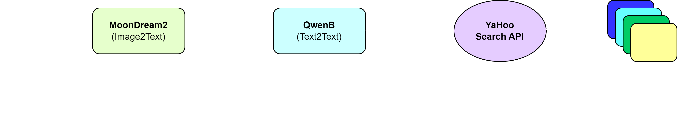

# Intelligent Image and Prompt-Based Web Search Pipeline

## Overview

This project aims to develop an intelligent pipeline that combines visual inputs (images) and contextual user queries (prompts) to enhance web search efficiency. Below is the pipline for the project




## Features

- **Image and Prompt Processing**: Takes an image and user-defined prompt as input.
- **Contextual Search**: Returns relevant web search results based on the user's input image and prompt.
- **Open-Source Models**: Utilizes open-source models for processing, ensuring compliance with project restrictions.

### Example Use Cases:

1. **Input Image**: Red Bull can 

    

   **Input Prompt**: Show me other products that belong to the same category.  
   **Output**: Web search results featuring energy drinks.

   


2. **Input Image**: A black hoodie with a Superman logo  

    

   **Input Prompt**: Show me t-shirts with the same design.  
   **Output**: Web search results showing t-shirts with the Superman logo.

   


## Project Workflow

1. **Input Handling**: User provides an image and a prompt.
2. **Processing**:
   - The image is analyzed using *MoonDream2* understand its category and features.
   - The prompt with description is interpreted using an *Qwen2.5* to extract the search intent.
3. **Web Search API Call**: The query is sent to *yahoo search API* to retrieve relevant search results.
4. **Output**: Display the n most relevant results that match the user's search intent.

## Installation

1. Clone the repository:

    ```bash
    git clone https://github.com/your-username/lost-found.git
    cd lost-found
    ```

2. Install dependencies:

    ```bash
    pip install -r requirements.txt
    ```

3. Run the app:

    ```bash
    streamlit run app.py
    ```


## Technologies Used

- **Image2Text Models**: MoonDream2  *https://huggingface.co/vikhyatk/moondream2*
- **Text2Text Models**: Qwen2.5  *https://huggingface.co/Qwen/Qwen2.5-1.5B-Instruct* 
- **Web Search APIs**: Yahoo web search api.
- **Streamlit**: A simple web app interface for  the project.
- **Python**: The core programming language for the pipeline.

*Note that first time running takes time due to model loading*